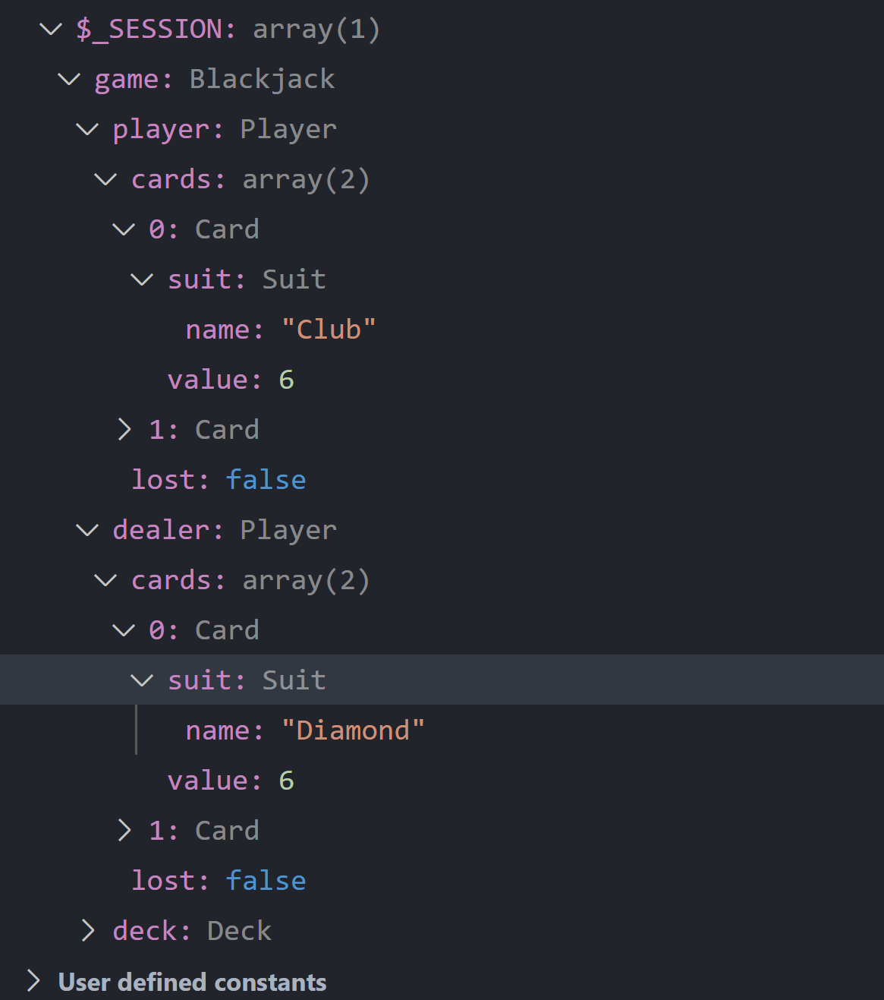

# PHP OOP Blackjack Game

## The mission

Let's make a game in PHP: Blackjack! A game of chance and luck!

To keep the code structured for this complicated game, we are going to use classes and objects.

Your coach has provided you with some starter classes that you can use for the game, to help you out on your first OOP challenge. First spent some time reading these classes and really understand what they are doing. If something in the syntax is unclear, google it first and then ask your coach.

If this is still an unclear subject for you don't feel bad to google some basic OOP articles, or ask your coach. it is normal this feels difficult, because object oriented programming is a really complex subject!

## Assignment duration and type

We had 2️⃣ days to complete it (28/10 - 29/10) and it was a solo exercise  
Note: Any number next to ✔ or ❌ means in which day I considered the feature/todo resolved or in which day I tackeled it

## Instructions / To do

1. ✔ <b>:one:</b> Create a class called `Player` in the file `Player.php`
2. ✔ :one: Add 2 private properties:
   - ✔1️⃣ `cards` (array)
   - ✔1️⃣ `lost` (bool, default=false)
3. Add a couple of empty public methods to this class:
   - ✔1️⃣ `hit`
   - ✔1️⃣ `surrender`
   - ✔1️⃣ `getScore`
   - ✔1️⃣ `hasLost`
4. ✔1️⃣ Create a class called `Blackjack` in the file `Blackjack.php`
5. ✔1️⃣ Add 3 private properties (to the `Blackjack` class)
   - ✔1️⃣ `player` (Player)
   - ✔1️⃣ `dealer` (Player for now)
   - ✔1️⃣ `deck` (Deck)
6. Add the following public methods:
   - ✔1️⃣ `getPlayer` (returns the `player` object)
   - ✔1️⃣ `getDealer` (returns the `dealer` object)
   - ✔1️⃣ `getDeck` (returns the `deck` object)
7. In the constructor (of `Blackjack` class) do the following:
   - ✔1️⃣ Instantiate the Player twice, insert it into the `player` property and a `dealer` property
   - 🙏 Create a new `deck` object (code for this was already written for us 🙏)
   - ✔1️⃣ Shuffle the cards with `shuffle()` method on deck
8. In the constructor of `Player` class:
   - ✔ 1️⃣ 🤔 Make it expect the `Deck` object as a parameter
   - ✔ 1️⃣ 🤔 Pass this `Deck` from the `Blackjack` constructor
   - ✔ 1️⃣ Now draw 2 cards for the player. You have to use an existing method for this from the Deck class
9. Go back to the `Player` class and add the following logic in your empty methods:

   - ✔1️⃣ `getScore` loops over all the cards and returns the total value of that player
   - ✔1️⃣ `hasLost` will return the bool of the lost property
   - ✔1️⃣ `hit` should add a card to the player. If this brings him above 21, set the `lost` property to `true`. To count his score use the method `getScore` you wrote earlier. This method should expect the `$deck` variable as an argument from outside, to draw the card.
   - ✔1️⃣ `surrender` should make you surrender the game (Dealer wins). This sets the property `lost` in the `player` instance to true.
   - 🙏 `stand` does not have a method in the player class but will instead call hit on the `dealer` instance. (you have to do nothing here) 🙏

## Creating the index.php file

1. ✔ 1️⃣ Create an index.php file with the following code:

   - ✔1️⃣ Require all the files with the classes you already created.
   - ✔1️⃣ Start the PHP Session
   - ✔1️⃣ If the session does not have a `Blackjack` variable yet:
     - ✔1️⃣ Create a new `Blackjack` object
     - ✔ 1️⃣ Put the `Blackjack` object in the session

2. ✔1️⃣ Use buttons or links to send to the `index.php` page what the player's action is (hit, stand or surrender)

### Captain's log, end of day 1

> Most of the day was spent reading about OOP on php.net or w3schools.com or wherever I could find explanations on how it works and so on. The already included classes and example were very helpful.  
> However, I'm not 100% sure that I'm doing things the right way or if it will even work.  
> I have used the almighty `var_dump` and it does look like it does work in some way, shape or form.  
> Also, Xdebug shows something is there so...

I hope this means something is working as it should so far....  

> If anything, I'm improving my markdown skills, which is still a win in my book 😂

## Start of day 2

We continue with the requirements for our Blackjack game.

## The dealer

So far we are assuming the player and dealer play with the same rules, hence they share a class. There is of course an important difference: the dealer does keep playing with the function `hit` until he has at least 15.

1. ✔2️⃣ To change this behavior, we have are going to take the `player` class and extend it to a newly created `dealer` class.
2. ✔2️⃣ Change the `Blackjack` class to create a new `dealer` object instead of a `player` object for the property of the dealer.
3. ✔2️⃣ Now create a `hit` function that keeps drawing cards until the dealer has at least 15 points. The tricky part is that we also need the `lost` check we already had in the `hit` function of the player. We could just copy the code but duplicated code is never the solution, instead you can use the following code to call the old `hit` function `parent::hit();`

## Final push

All classes are ready, now you just need to write some minimal glue in the `index.php`. The final result should be the following:

1. ✔2️⃣ When you click the 'hit' button call `hit` on player, then check the lost status of the player. You will need to pass a Deck variable to this function, you can use the `Blackjack::getDeck()` method for this.
2. ✔2️⃣ When you click the stand (stay) button call `hit` on dealer, then check the lost status of the dealer. If he is not lost, compare scores to set the winner (if equal the dealer wins).
3. ✔2️⃣ <b>Surrender</b>: the dealer wins automatically
4. ✔2️⃣ Always display on the page the score for both players. If you have a winner, display it
5. 🤔2️⃣End of the game: destroy the current `blackjack` variable so the game restarts.
   - note: right now, the only way to restart the game is by clicking the `New game` button

# Nice to have

- ❌Implement a betting system
  - ❌every new player (new session) starts with 100 chips
  - ❌after the player gets his first 2 cards, every round ask how much he wants to bet. Minimum bet is 5 chips.
  - ❌if the player wins the game he gets double the amount of chips
- 🤔2️⃣Implement the blackjack first first turn rule: if the player draws 21 the first turn, he wins directly. If the dealer draws 21 the first turn, he wins. If both draw 21, it's a tie.

  - when you both nice to have features, a blackjack means an auto win of 10 chips, a blackjack for the dealer a loss of 5 chips for the player.

  ### Captain's log, end of day 2, the week and the exercise

  > It has been a challenging exercise to say the least, having the card, deck and suit classes already made for us was very helpful. Right now everything works except for the betting system and some conditions from the nice to have part that checks the score for both the player and the dealer at the start of the game. Right now, only if the player has 21 points at the start, he wins. But like always, it is nice to see something that you put together, working. 😊
